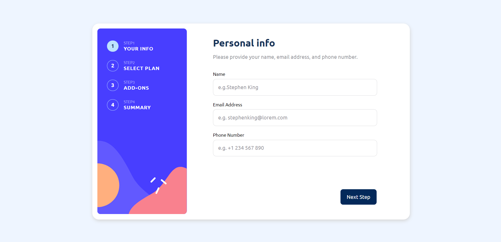
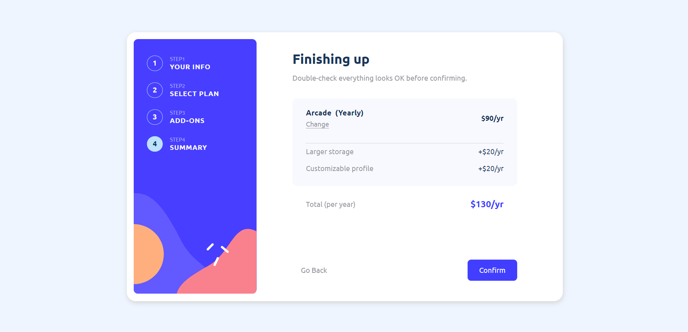
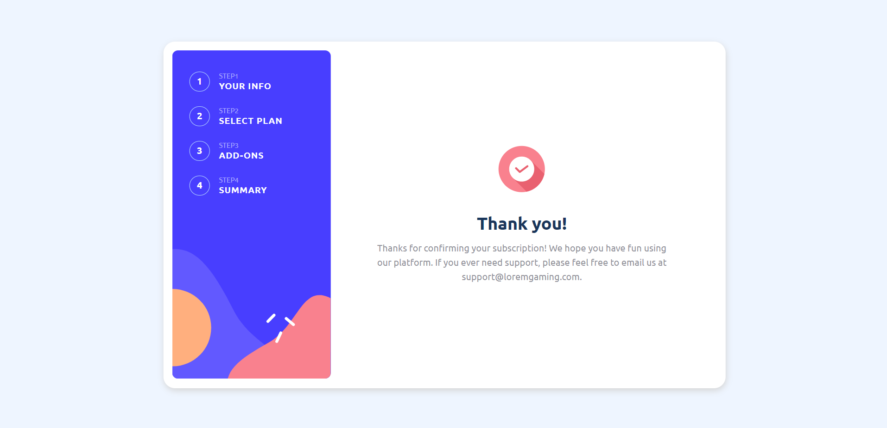
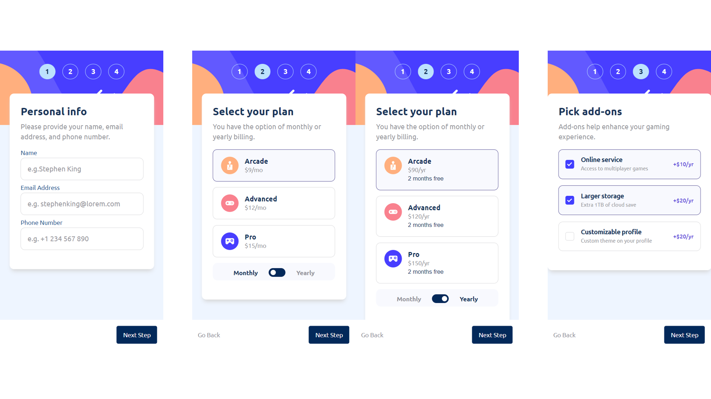
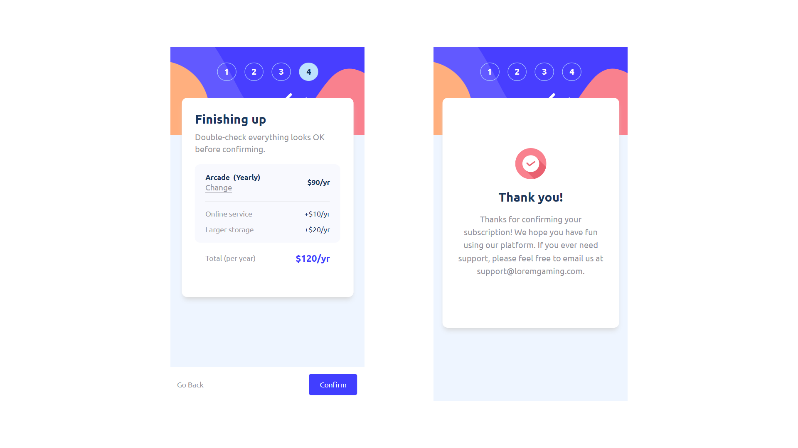

# AI-Assisted Multi-Step Form

一个使用 Vue 3 与 TypeScript 构建的多步骤订阅表单，并通过 [Alibaba Page Agent](https://github.com/alibaba/page-agent) 加入自然语言页面操作能力。访客可以描述套餐偏好，让 AI 自动填写演示资料、选择计费周期与附加服务，并在汇总页交还最终确认权。

An AI-assisted multi-step subscription form built with Vue 3 and TypeScript. With [Alibaba Page Agent](https://github.com/alibaba/page-agent), visitors can describe their preferences in natural language while the agent fills demo data, selects billing options and add-ons, then hands control back at the summary step.

[在线演示 / Live Demo](https://mr-cg-end.github.io/multi-step-form/) · [Page Agent](https://github.com/alibaba/page-agent)

---

## 中文介绍

### 项目亮点

- **五步订阅流程**：个人资料、套餐选择、附加服务、订单汇总与完成页面
- **Page Agent 智能体**：基于自然语言完成跨步骤表单操作与控件交互
- **三条推荐体验指令**：内置高频典型场景，同时支持自定义偏好输入
- **多语言支持**：简体中文 (zh-CN)、繁体中文 (zh-TW) 与英文 (en) 实时切换
- **状态持久化**：Pinia 状态管理结合 LocalStorage 本地持久化，页面刷新数据不丢失
- **严格表单校验**：实时防抖校验邮箱格式与中国大陆手机号
- **响应式界面**：完美适配桌面端与移动端屏幕
- **无障碍访问**：完整的键盘操作支持、ARIA 状态提示与清晰的表单语义

### AI 演示说明与推荐指令

点击默认位于右侧的液态波浪悬浮球展开自有对话面板；悬浮球可自由拖动并记忆位置。首次使用请阅读说明并点击“同意并开始”。可以一次只发送一项信息（如“我叫陈墨”“邮箱 chenmo@example.com”“年付专业版”），助手会累积信息并追问缺失项。以下套餐指令也可逐条补充：

1. **指令一**：`选择年度专业版，不添加附加服务。`
2. **指令二**：`选择月度基础版，添加在线服务和自定义个人资料。`
3. **指令三**：`选择年度高级版，添加更大存储空间。`

#### 核心行为与安全规范
- **本地个人资料**：姓名、邮箱和手机号在浏览器本地解析、校验和填写；示例指令使用虚构资料，不再静默套用固定身份。
- **汇总步交还确认权**：AI 会依次完成前三步填写，并精准**停留在第 4 步汇总页**，不会自动点击最终确认提交，由访客亲自核对信息后决定是否提交。
- **隐私保护**：外部服务只接收规范化的套餐任务和脱敏页面结构；对话内容不持久化。
- **事务式执行**：执行前保存快照，主动停止恢复原表单；演示服务失败或结果不一致时本地修正并提示。缺少或冲突的指令不会修改表单。

> [!IMPORTANT]
> - **技术评估性质**：本功能为基于 Page Agent 官方免费测试 API 的前端技术评估与演示，非生产级 AI 业务系统。
> - **测试接口说明**：官方测试 API 可能存在请求限流、响应延迟或临时维护等情况；测试接口异常不影响普通表单的正常手动填写与提交流程。
> - **请勿输入真实信息**：请勿在演示界面输入真实姓名、邮箱、手机号或其他敏感隐私数据。

---

## English Overview

### Highlights

- **Five-Step Subscription Flow**: Personal info, plan selection, add-ons, order summary, and completion.
- **Page Agent Integration**: Natural-language-driven GUI automation across steps.
- **Three Recommended Preset Prompts**: Ready-to-run scenarios plus custom preference input.
- **Internationalization (i18n)**: Seamless switching between Simplified Chinese, Traditional Chinese, and English.
- **Persistent State**: Pinia state management with LocalStorage persistence across page refreshes.
- **Form Validation**: Real-time debounced email and mobile phone validation.
- **Responsive Layout**: Optimized for desktop and mobile viewports.
- **Accessibility (a11y)**: Full keyboard navigation, ARIA live region updates, and semantic HTML form controls.

### AI Demo Guide & Recommended Prompts

Open the liquid-edge orb on the right. Drag it freely; its position is remembered. After reviewing the consent notice, send details one at a time (for example, your name, then email, then plan). The custom assistant remembers each answer and asks for missing fields. You can also start with these plan instructions:

1. **Preset 1**: `Select Yearly Pro plan without addons.`
2. **Preset 2**: `Select Monthly Arcade plan with Online service and Customizable profile.`
3. **Preset 3**: `Select Yearly Advanced plan with Larger storage.`

#### Execution Behavior & Privacy Safeguards
- **Local Personal Details**: Names, emails, and phone numbers are parsed, validated, and filled locally. Presets use fictitious details; the assistant no longer silently applies a default identity.
- **Summary Step Handover**: The agent completes steps 1–3 and **stops on Step 4 (Summary)** without clicking final confirmation, leaving the final submission decision to the user.
- **Privacy Protection**: Only normalized plan instructions and redacted page content reach the external service. Conversations are not persisted.
- **Transactional Execution**: Stopping restores the previous snapshot. Failed or inconsistent demo results are corrected locally with a visible notice. Incomplete or conflicting commands leave the form unchanged.

> [!IMPORTANT]
> - **Evaluation Only**: This is a frontend technology demonstration powered by the Page Agent public test API, not a production AI service.
> - **Test API Notice**: The testing API may experience rate limiting, latency, or temporary downtime. The regular form remains fully functional regardless of the AI test service status.
> - **Do Not Enter Real Data**: Please do not provide real personal names, emails, phone numbers, or sensitive data.

---

## 技术栈 / Tech Stack

- **Framework**: Vue 3 (Composition API, `<script setup>`)
- **Language**: TypeScript 5.x
- **State Management**: Pinia 2.x
- **Routing**: Vue Router 4.x
- **i18n**: Vue I18n 9.x
- **Styling**: SCSS
- **AI Agent**: [Alibaba Page Agent 1.12.2](https://github.com/alibaba/page-agent)
- **Package Manager**: pnpm

---

## 本地开发与发布 / Development & Deployment

### 本地运行 / Local Development

```bash
# 安装依赖
pnpm install

# 启动本地开发服务器
pnpm run dev
```

### 测试、代码检查与构建 / Test, Lint & Build

```bash
# 运行自动化测试
pnpm run test

# 代码风格与语法检查
pnpm run lint

# 生产环境编译构建（产物输出至 dist 目录）
pnpm run build
```

### 发布到 GitHub Pages / Deploy

`main` 分支保存项目源码；发布时会先生成 `dist`，再由 `gh-pages` 工具把构建产物推送到专用的 `gh-pages` 分支。GitHub Pages 需设置为从 `gh-pages` 分支的根目录发布，请勿直接在该分支修改源码。

The `main` branch contains the source code. Deployment builds `dist` and publishes those generated files to the dedicated `gh-pages` branch. Configure GitHub Pages to serve from the root of `gh-pages`, and do not edit source code directly on that branch.

```bash
# 自动执行 predeploy (构建) 并推送 dist 到 gh-pages 分支
pnpm run deploy
```

发布地址 / Published site: https://mr-cg-end.github.io/multi-step-form/

---

## 页面预览 / Screenshots

### 桌面端 / Desktop

| 个人资料 / Personal Info | 套餐选择 / Select Plan |
| --- | --- |
|  |  |

| 订单汇总 / Summary | 完成页面 / Thank You |
| --- | --- |
|  |  |

### 移动端 / Mobile

| 移动端表单 / Mobile Form | 移动端套餐 / Mobile Plan |
| --- | --- |
|  |  |

---

## 隐私与第三方服务 / Privacy and Third-Party Services

Page Agent 在浏览器内分析脱敏后的页面 DOM 结构，仅在访客补齐指令后将规范化套餐任务及必要视图信息发送至官方测试服务。姓名、邮箱和手机号由本地执行器处理，对话记录仅存在于当前页面。技术演示仍建议使用虚构资料。

- [Page Agent Terms of Use & Privacy](https://github.com/alibaba/page-agent/blob/main/docs/terms-and-privacy.md)
- [Page Agent GitHub Repository](https://github.com/alibaba/page-agent)

---

## 开源许可与致谢 / License & Credits

- 本项目基于 [MIT License](https://opensource.org/licenses/MIT) 开源。
- [Alibaba Page Agent](https://github.com/alibaba/page-agent) - 页面内智能体自动化能力
- [Frontend Mentor](https://www.frontendmentor.io/) - 多步骤表单 UI 设计与交互规范
- [React Bits Orb](https://reactbits.dev/backgrounds/orb)、[ElevenLabs UI](https://github.com/elevenlabs/ui) - 液态球形助手的视觉参考；本项目采用独立 Canvas 实现。
