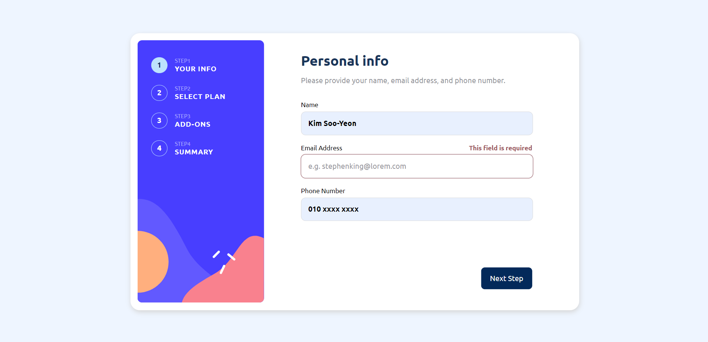
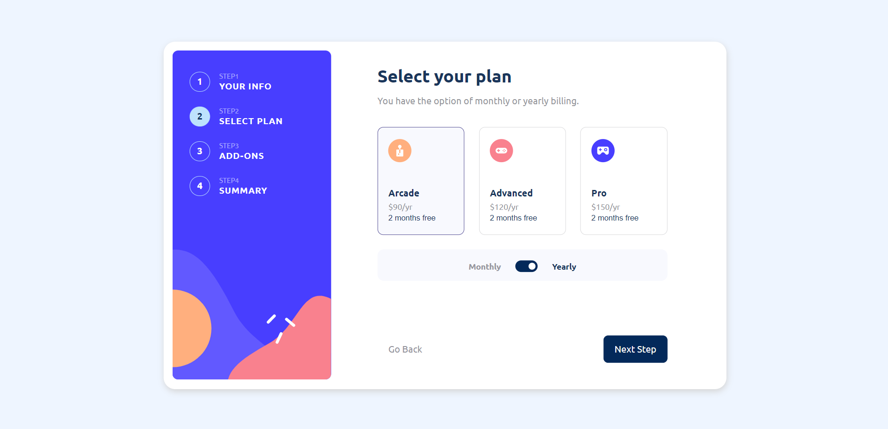
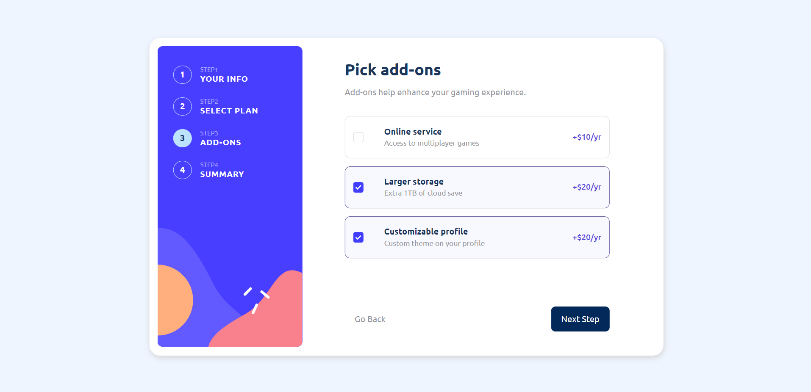

# 多步骤表单

#Typescript #Vue3.x (#Pinia) #SCSS

## 桌面端

 

:small_orange_diamond: 步骤 1

 

:small_orange_diamond: 步骤 2

（月度）

（年度）

 

:small_orange_diamond: 步骤 3

 

:small_orange_diamond: 步骤 4

 

:small_orange_diamond: 感谢页面

## 移动端

 
 
